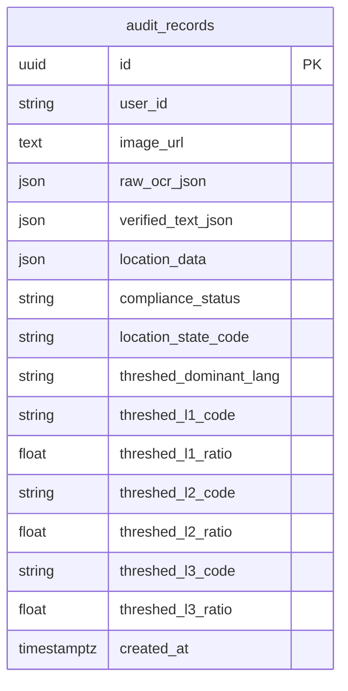

# Project schema — OCR / compliance (reference document)

**Formats**

| How you want it | File |
|-----------------|------|
| **Markdown** (this file) | `docs/Project-Schema-Document.md` — use in Git, VS Code, or *Open* in **Microsoft Word** (Word can open .md) |
| **Print / PDF** | `docs/Project-Schema-Document.html` — open in Chrome/Edge → **Print** → *Save as PDF* |
| **API machine schema** | Run the backend, open `/openapi.json` or `/docs` (Swagger) |

**Scope:** persistence layer, `OcrResult` JSON, and how they connect. Code truth: Pydantic in `backend/main.py`, ORM in `backend/db_models.py`.

---

## 1. Database

**Engine:** `DATABASE_URL` (PostgreSQL) or default `sqlite:///./ocr_audit.db` (`backend/database.py`).

### 1.1 Table `audit_records`

| Column | Type | Notes |
|--------|------|--------|
| `id` | UUID, PK | Default `uuid.uuid4()` |
| `user_id` | VARCHAR(256), nullable, indexed | Optional client id (e.g. from `localStorage`) |
| `image_url` | TEXT, not null | Public URL of stored upload (local `/files/...` or S3/CDN) |
| `raw_ocr_json` | JSON / JSONB, not null | **Full** `OcrResult` document as returned by `POST /api/ocr` (see §2) |
| `verified_text_json` | JSON / JSONB, nullable | Map of block index (string) → user-corrected text for audit |
| `location_data` | JSON / JSONB, nullable | `state_code`, `city`, `latitude`, `longitude`, `geocoded`, etc. |
| `compliance_status` | VARCHAR(32), not null | `PENDING` \| `PASS` \| `FAIL` \| `UNCERTAIN` (see `ComplianceStatus` enum) |
| `location_state_code` | VARCHAR(8), nullable, indexed | Denormalized from location / rules for reporting |
| `threshed_dominant_lang` | VARCHAR(16), nullable | BCP-47 (dominant threshed script) |
| `threshed_l1_code` … `threshed_l3_code` | VARCHAR(8), nullable, some indexed | Top 3 threshed languages by share |
| `threshed_l1_ratio` … `threshed_l3_ratio` | DOUBLE / REAL, nullable | Ratios 0–1 for those ranks |
| `created_at` | timestamptz, not null, server default `now()` | — |

`init_db()` runs `Base.metadata.create_all` and **alters** existing databases to add columns listed in `_ensure_audit_columns` when missing.

There are **no foreign keys** to other tables: the app is a single-entity audit store plus file blobs on disk or S3.

---

## 2. API model: `OcrResult` (and `raw_ocr_json`)

`OcrResult` is the **JSON shape** of `POST /api/ocr` and `PUT /api/audit/{id}`. The same object (minus `audit_id` in the first write) is stored in `audit_records.raw_ocr_json`. Responses from the server may add or refresh `audit_id` and merge `compliance` / `resolved_location` after an audit update.

### 2.1 Top-level fields

| Field | Type | Description |
|-------|------|-------------|
| `text` | string | Full concatenation of block text (see Vision) |
| `image_width` | int | Image width in pixels (Vision first page) |
| `image_height` | int | Image height in pixels |
| `languages` | `LanguageHint[]` | Page-level language hints from Vision |
| `blocks` | `TextBlock[]` | Per-region text, boxes, words, optional translation |
| `logos` | `LogoResult[]` | Logo detections |
| `gstin` | `GstinFinding[]` | Extracted GSTINs + validation flags |
| `compliance` | `ComplianceInfo` | Rules + optional governance object |
| `translated_text` | string | Full signboard in English when Gemini has filled translations |
| `signboard_geometry` | object \| null | Threshed-ink / OpenCV language metrics; null for PDFs or on failure |
| `is_pdf_ocr` | bool | True when input was treated as PDF |
| `audit_id` | string \| null | UUID string when a row was persisted |
| `resolved_location` | object \| null | Geocode / form resolution: `state_code`, `city`, `state_name`, `latitude`, `longitude` |
| `verified_text_json` | object \| null | Block-index → string corrections (may be present when reloaded from DB) |
| `image_metadata` | object \| null | File + EXIF + dimensions (see §2.3) |

### 2.2 Nested DTOs (summary)

- **`LanguageHint`:** `code` (BCP-47), `confidence` (0–1).
- **`BoundingBox`:** `x`, `y`, `w`, `h` (pixels).
- **`NormArea`:** `x_pct`, `y_pct`, `w_pct`, `h_pct`, `area_pct` (0–100), optional `threshed_area_pct`.
- **`VerifiedWord`:** `text`, `confidence`, `is_doubtful`.
- **`TextBlock`:** `text`, `bounds`, `norm`, `languages[]`, `words[]`, `translated_text` (optional).
- **`LogoResult`:** `name`, `confidence`, `bounds`, `norm`.
- **`GstinFinding`:** `value`, `format_valid`, `checksum_valid`, `block_index` (optional).
- **`ComplianceInfo`:** `status`, `message`, `ruleset_id` (optional), `governance` (optional free-form dict: `headline`, `overall`, `automated[]`, `not_verifiable[]`, `ink_rule_eval`, …).
- **`SignboardGeometrySummary`:** `language_ratios` (BCP-47 → 0–1), `language_details` (per-lang metrics), `compliance_status`, `confidence_score`, `dominant_language`, `primary_language`, `primary_ratio`, `monolingual_single_lang` (optional).

### 2.3 `image_metadata` (produced by `image_metadata.build_image_metadata`)

| Key | Content |
|-----|--------|
| `file` | `name`, `size_bytes`, `content_type` |
| `raster` | For non-PDF: Pillow decode — `format`, `width_px`, `height_px`, `color_mode`, optional `exif` (tag name → value), or `error` if decode failed; for PDF: short `note` |
| `vision` | `width`, `height` (match `image_width` / `image_height` when set) |
| `pdf` | When applicable: `{ "is_pdf": true }` |

---

## 3. Other API request/response bodies

| Endpoint | Body / model |
|----------|----------------|
| `POST /api/ocr` | `multipart/form-data`: `file`, optional `user_id`, `state_code`, `latitude`, `longitude` |
| `PUT /api/audit/{audit_id}` | JSON `AuditUpdate`: `user_id`, `latitude`, `longitude`, `state_code`, `city`, `verified_text_json` |
| `POST /api/translate` | JSON `TranslateRequest`: `texts[]`, optional `languages[]` |
| `POST /api/suggest-corners` | `multipart/form-data`: `file`, optional `state_code` |
| `POST /api/suggest-corners` response | `SuggestCornersResult`: `corners` (4×`[x,y]`), `method` (`text_hull` \| `full_image`), `image_width`, `image_height` |

---

## 4. Frontend

TypeScript mirrors the API in `frontend/src/ocrTypes.ts` (`OcrResult`, `ImageMetadata`, etc.). The UI does not add a second canonical schema; it types the same JSON as §2.

---

## 5. File storage (not in SQL)

- **Local:** `LOCAL_STORAGE_DIR` or `backend/data/uploads/`; served under `PUBLIC_BASE_URL` + `/files/{uuid}{ext}`.
- **S3:** when `S3_BUCKET` is set, same key pattern; public URL from `S3_PUBLIC_BASE_URL` if set.

`image_url` in `audit_records` always points at this object.

---

## 6. OpenAPI

With the FastAPI app running, the generated OpenAPI document includes all Pydantic models: **`/docs`** (Swagger UI) or **`/openapi.json`**.

This document is a **human-readable** companion to those definitions and to the ORM in `db_models.py`.
